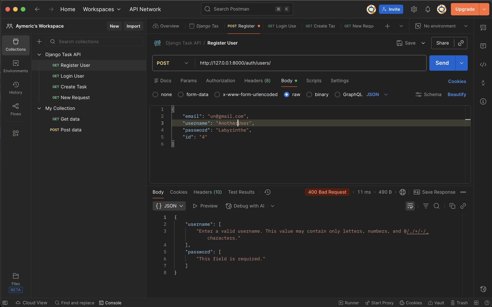
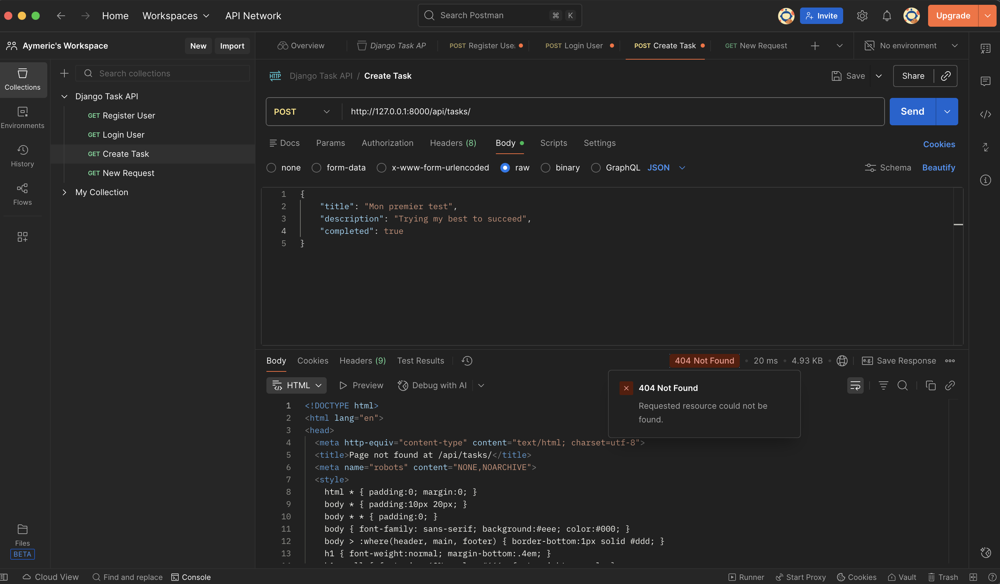
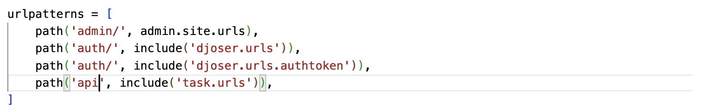
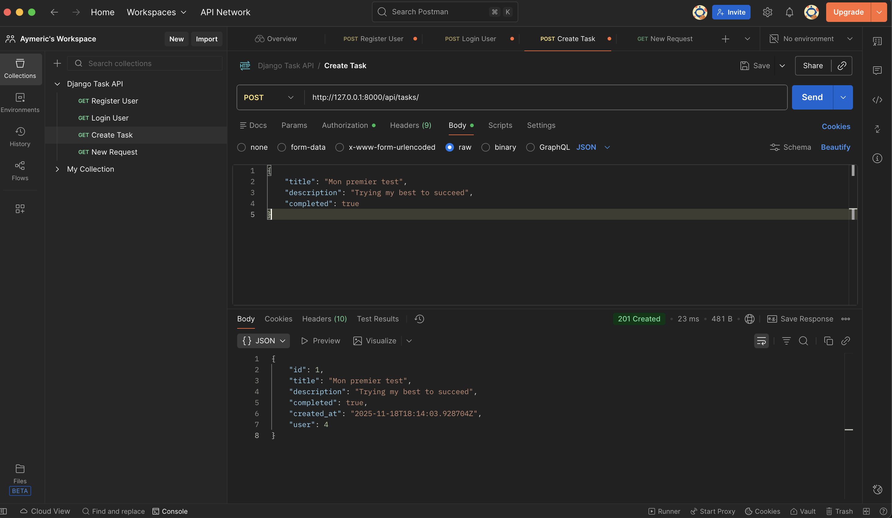
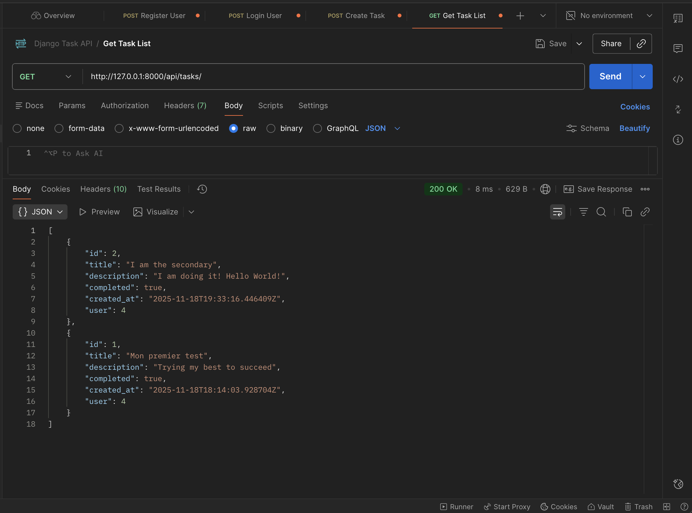
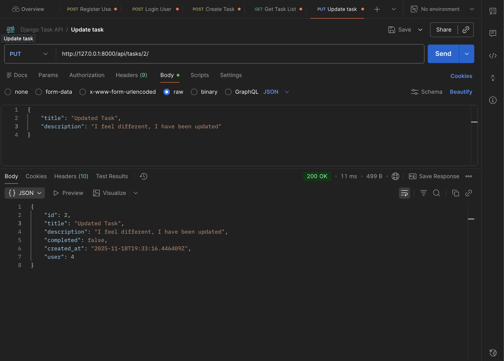
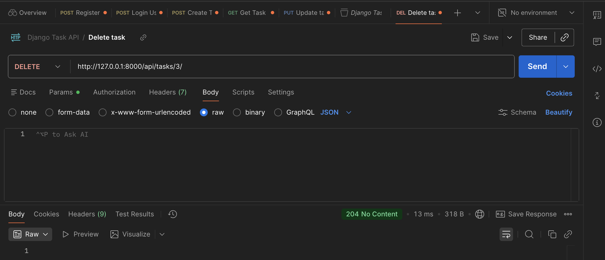

# TaskAPI_POSTMAN

It is a project to show off my understanding of REST API and used POSTMAN for test.

Used Django to design it.

## Issue encountered

- Error creating users because I used space in the username and forgot the password field. Issue corrected. By removing the space in username and adding a password. **SOLVED**

- Failed to create a task because the URL in my URLs DJANGO was incorrect. I forgot the slash (’/’) in api/. Also, forgot to add in headers the Authentication Token. **SOLVED**

## Successful Other Tests

